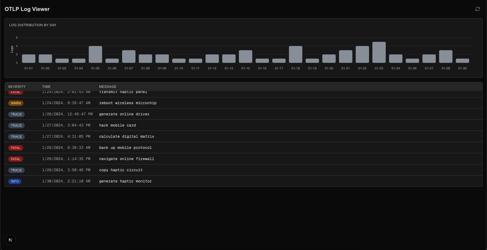

# OTLP Log Viewer

This is a simple NextJS-based OTLP log viewer, taking an `IExportLogsServiceRequest` response and displaying a flat list of log records, along with a histogram chart with a log count distribution over a given day.

## Technical specs

- Since the required OLTP types are now deemed internal in [@opentelemetry/otlp-transformer](https://www.npmjs.com/package/@opentelemetry/otlp-transformer), they have been added in this repository as needed.
- The application uses a single internal API route to fetch logs from the source. This also helps with any CORS-related issues.
- A default Tailwind config is being used for iteration speed.
- [Tanstack Query](https://tanstack.com/query/latest/docs/framework/react/overview) is used as the data fetching toolkit, with default global config. In a more complex scenario an API client abstraction would be used to streamline error handling (among other things), so that the library's lifecycle events can be handled correctly. For the task at hand a simple `queryFn` definition is fine.
- The `LogViewer` main component uses a simple `useReducer`-based state machine to avoid messy conditionals and provides support for loading, "with-data", error and "empty" view states, mostly abstracted out into simple UI components.

## Features

- Displays a flat list of log records and the day-based log count distribution.
- Scrolls to the latest log record when a fresh data set is received.
- An ability to refresh the feed manually via the top-right icon button
- Support for loading, error and no data states.
- OS-aware theme switch (light and dark modes).
